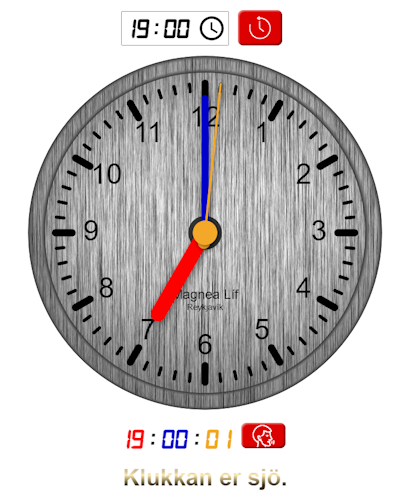

# Talandi klukka

Einföld klukka sem hentar vel til kennslu yngri barna.

## Eiginleikar

Helstu eiginleikar eru:

* Sýnir rauntíma.
* Skrunstýring til að handstilla klukku.
  + Hægt að rúlla yfir tímasviðið.
  + Klukkan sett aftur á með því að hreinsa innslátt.
* Smella má á hnapp 'tala' til að segja klukkuna upphátt.

## Hvernig get ég keyrt þetta

* Hægt er að keyra html skrá beint. 
https://raw.githack.com/adalsteinnbjarnason/talandi-klukka/main/index.html
* Einnig má sækja zip skrá verkefnisins yfir á tölvu, afpakka og keyra. 
https://github.com/adalsteinnbjarnason/talandi-klukka/archive/refs/heads/main.zip

## Það sem á eftir að gera

* Input time stýring
  + Sýna bara 24 stunda ham.
  + Stýring sést ekki í Android eða IOS.
* Hliðræn sýn klukku
  +  Laga reglulegt flökt á bakgrunni.
  +  Síða þarf birtast rétt í Android eða IOS (bakgrunnur sést ekki).
* Talgervill
  + 2:29 er réttilega sagt sem "Klukkan er tuttugu og níu mínútur yfir tvö.". 
Á hinn bóginn er 2:30 breytt úr "Klukkan er þrjátíu mínútur yfir tvö.". 
yfir í "Klukkan er hálf tvö." :-) (ætti að vera þrjú).
  + Bæta við "á gamla mátann" s.s. "gengin í" og "vantar".
  + Bæta við fleiri tungumálum s.s. ensku og dönsku.

## Heimildir

Kóðinn er fenginn héðan og þaðan og eru tilvísanir hérna að neðan.

* [Free Text-to-MP3](https://ttsmp3.com/)
* [Digital-7 Font](https://fonts2u.com/font-designers/sizenko-alexander.html)
* [THOOCLOCK](https://www.smart-sign.com/thooclock/)
* [THOOCLOCK license](https://github.com/thooyork/thooClock/blob/master/LICENSE)
* [Clock face](https://www.freepik.com/free-photo/lined-metal-background_4102532.htm)

## Leyfi

[MIT](https://choosealicense.com/licenses/mit/)
